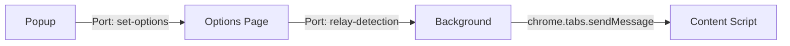

## Overview

Posture!Posture!Posture! is a Chrome extension built with React and TensorFlow.js that uses your webcam to monitor posture while browsing. The extension follows the standard Chrome Extension Manifest V3 architecture with four main components:

1. **Background Service Worker** - Message relay and badge management
2. **Options Page** - Webcam interface and pose detection logic
3. **Popup** - Quick controls for starting/stopping tracking
4. **Content Script** - Visual feedback on web pages

## Extension Structure

<Tabs>
  <Tab title="Background">
    The background service worker acts as a message relay between the Options page and Content script.

    **File**: `src/pages/Background/index.js`

    **Responsibilities**:
    - Manages extension badge (ON/OFF status)
    - Relays posture detection messages from Options to Content script
    - Establishes port connections for real-time communication

    ```javascript
    // Set initial badge state
    chrome.action.setBadgeText({ text: 'OFF' });

    // Listen for port connections
    chrome.runtime.onConnect.addListener(function (port) {
      if (port.name === 'relay-detection') {
        port.onMessage.addListener(handlePostureMessage);
      }
    });
    ```
  </Tab>

  <Tab title="Options Page">
    The Options page is the core of the extension where pose detection happens.

    **File**: `src/pages/Options/Options.tsx`

    **Responsibilities**:
    - Loads and runs the MoveNet pose detection model
    - Captures webcam video feed
    - Detects user's eye position and compares to baseline
    - Sends posture status messages to background script
    - Provides UI for starting/stopping tracking and resetting baseline

    **Key Features**:
    - React component with hooks for state management
    - TensorFlow.js integration for real-time pose detection
    - Canvas overlay for visualizing keypoints and skeleton
    - Multi-camera support with device selection
  </Tab>

  <Tab title="Popup">
    The Popup provides quick access to extension controls.

    **File**: `src/pages/Popup/Popup.jsx`

    **Responsibilities**:
    - Display current tracking status
    - Start/Stop tracking
    - Reset posture baseline
    - Open the Options page in a popup window

    **Connection Flow**:
    ```javascript
    // Connect to Options page via port
    port.current = chrome.runtime.connect({ name: 'set-options' });

    // Receive status updates
    port.current.onMessage.addListener(function (msg) {
      if (msg.action === 'SET_IS_WATCHING')
        setIsWatching(msg.payload.isWatching);
    });
    ```
  </Tab>

  <Tab title="Content Script">
    The Content script injects visual feedback into web pages.

    **File**: `src/pages/Content/Content.tsx`

    **Responsibilities**:
    - Listen for posture messages from background script
    - Apply CSS classes to document body based on posture
    - Display "Sit Up Straight!" banner when posture is bad

    **Implementation**:
    ```typescript
    chrome.runtime.onMessage.addListener(function (msg: { posture: string }) {
      if (msg.posture === BAD_POSTURE) handleBadPosture();
      if (msg.posture === GOOD_POSTURE) handleGoodPosture();
    });
    ```
  </Tab>
</Tabs>

## Manifest Configuration

The extension uses **Manifest V3** with the following key configurations:

```json
{
  "manifest_version": 3,
  "name": "Posture!Posture!Posture!",
  "description": "Sit up Straight! This extension will help you track your posture as you browse with the help of your webcam.",
  "options_page": "options.html",
  "background": {
    "service_worker": "background.bundle.js"
  },
  "action": {
    "default_popup": "popup.html",
    "default_icon": "icon-34.png"
  },
  "content_scripts": [
    {
      "run_at": "document_end",
      "matches": ["http://*/*", "https://*/*"],
      "js": ["contentScript.bundle.js"],
      "css": ["content.styles.css"]
    }
  ]
}
```

<Note>
  The content script runs on all HTTP and HTTPS pages to provide posture feedback across your entire browsing experience.
</Note>

## Communication Flow

The extension uses Chrome's port-based messaging for real-time communication:



### Message Flow Example

1. **Options** detects bad posture → sends `{ posture: 'bad' }` via port
2. **Background** receives message → relays to active tab's Content script
3. **Content Script** receives message → adds `bad-posture` class to body
4. User sees "Sit Up Straight!" banner on the page

## Directory Structure

```
src/pages/
├── Background/
│   └── index.js              # Service worker
├── Options/
│   ├── Options.tsx           # Main options component
│   ├── Options.css           # Styles
│   └── modules/
│       └── draw_utils.ts     # Canvas drawing utilities
├── Popup/
│   ├── Popup.jsx             # Popup component
│   └── Popup.css             # Styles
└── Content/
    └── Content.tsx           # Content script component
```

## Technology Stack

- **React** - UI component library
- **TypeScript** - Type-safe JavaScript (Options, Content)
- **TensorFlow.js** - Machine learning in the browser
- **MoveNet** - Pose detection model
- **react-webcam** - Webcam access component
- **Chrome Extension APIs** - Messaging, storage, and extension lifecycle

<Accordion title="Why port-based messaging?">
  Port-based messaging (`chrome.runtime.connect`) is used instead of one-time messages (`chrome.runtime.sendMessage`) because the extension needs continuous, real-time communication between components. The Options page sends posture updates approximately every 100ms, making persistent connections more efficient than establishing new connections for each message.
</Accordion>