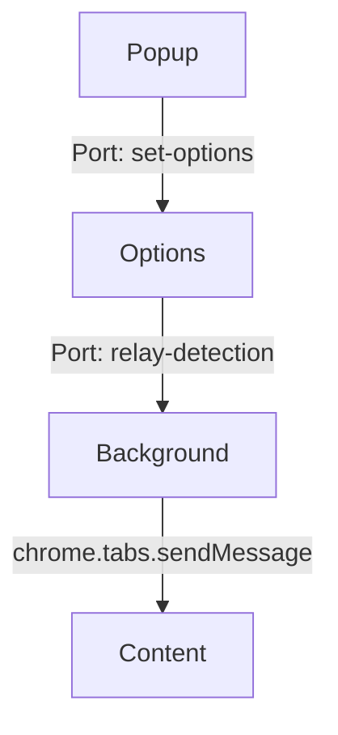

## Overview

The extension uses three main React components that handle different aspects of the user interface and functionality:

- **Options** - Full-featured webcam interface with pose detection
- **Popup** - Quick controls accessible from browser toolbar
- **Content** - Injected visual feedback on web pages

## Options Component

**File**: `src/pages/Options/Options.tsx`

The Options component is the heart of the extension, providing the webcam interface and running pose detection.

### State Management

```typescript
// Baseline eye position with good posture
let GOOD_POSTURE_POSITION = useRef<any>(null);

// Current detected eye position
let currentPosturePosition = useRef<any>(null);

// Deviation threshold (default: 25 pixels)
let GOOD_POSTURE_DEVIATION = useRef(25);

// Webcam toggle
const [isWatching, setIsWatching] = useState(false);

// Camera selection
const [deviceId, setDeviceId] = useState('');
const [devices, setDevices] = useState([]);

// Port connection for messaging
let portRef = useRef<any>(null);

// Info overlay visibility
const [isOverlayShowing, setIsOverlayShowing] = useState(false);
```

<Accordion title="Why refs instead of state for posture values?">
  `GOOD_POSTURE_POSITION` and `currentPosturePosition` use refs instead of state because they're updated on every detection cycle (100ms). Using state would trigger unnecessary re-renders, while refs allow direct value updates without React re-rendering the component.
</Accordion>

### Props

The Options component takes no props - it's a top-level component rendered in `options.html`.

### Key Methods

<Tabs>
  <Tab title="loadMoveNet">
    Initializes the pose detection model and starts the detection loop:

    ```typescript
    const loadMoveNet = async () => {
      const detectorConfig = {
        modelType: poseDetection.movenet.modelType.SINGLEPOSE_LIGHTNING,
      };
      detector = await poseDetection.createDetector(
        poseDetection.SupportedModels.MoveNet,
        detectorConfig
      );

      // Loop the pose detection
      setInterval(() => {
        return detect(detector);
      }, DETECTION_RATE);
    };
    ```

    **Called**: Once on component mount
    
    **Side effects**: 
    - Loads TensorFlow.js model (~3MB)
    - Starts continuous detection loop at 100ms intervals
  </Tab>

  <Tab title="detect">
    Main detection function that runs every 100ms:

    ```typescript
    const detect = async (model: { estimatePoses: (arg0: any) => any }) => {
      if (
        typeof camRef.current !== 'undefined' &&
        camRef.current !== null &&
        camRef.current.video.readyState === 4
      ) {
        const video = camRef.current.video;
        const videoWidth = camRef.current.video.videoWidth;
        const videoHeight = camRef.current.video.videoHeight;

        camRef.current.video.width = videoWidth;
        camRef.current.video.height = videoHeight;

        const poses = await model.estimatePoses(video);

        if (
          !poses ||
          !poses[0] ||
          !poses[0].keypoints ||
          poses[0].keypoints.length < 3
        )
          return;

        handlePose(poses);
        drawCanvas(
          poses,
          video,
          videoWidth,
          videoHeight,
          canvasRef,
          GOOD_POSTURE_POSITION.current
        );
      }
    };
    ```

    **Parameters**: MoveNet detector model
    
    **Returns**: void
  </Tab>

  <Tab title="handlePose">
    Analyzes detected pose and sends messages based on posture quality:

    ```typescript
    const handlePose = async (poses: { keypoints: { y: number }[] }[]) => {
      try {
        let rightEyePosition = poses[0].keypoints[2].y;
        currentPosturePosition.current = rightEyePosition;

        if (!rightEyePosition) return;
        
        // Set baseline on first detection
        if (GOOD_POSTURE_POSITION.current == null) {
          handlePosture({ baseline: currentPosturePosition.current });
        }

        // Check deviation
        if (
          Math.abs(
            currentPosturePosition.current - GOOD_POSTURE_POSITION.current
          ) > GOOD_POSTURE_DEVIATION.current
        ) {
          handlePosture({ posture: 'bad' });
        }

        if (
          Math.abs(
            currentPosturePosition.current - GOOD_POSTURE_POSITION.current
          ) < GOOD_POSTURE_DEVIATION.current
        ) {
          handlePosture({ posture: 'good' });
        }
      } catch (error) {
        console.error(error);
      }
    };
    ```

    **Parameters**: Array of detected poses
    
    **Side effects**: Sends messages via port to background script
  </Tab>

  <Tab title="handleToggleCamera">
    Starts or stops webcam tracking:

    ```typescript
    const handleToggleCamera = () => {
      setIsWatching((isCurrentlyWatching) => {
        if (!isCurrentlyWatching) {
          chrome.action.setBadgeText({ text: 'ON' });
          document.title = 'TRACKING POSTURE - Posture!Posture!Posture!';
        } else {
          chrome.action.setBadgeText({ text: 'OFF' });
          document.title = 'Posture!Posture!Posture! - Options';
        }

        return !isCurrentlyWatching;
      });
    };
    ```

    **Side effects**:
    - Updates extension badge (ON/OFF)
    - Changes page title
    - Toggles webcam visibility
  </Tab>

  <Tab title="handleResetPosture">
    Clears the baseline posture position:

    ```typescript
    const handleResetPosture = () => {
      GOOD_POSTURE_POSITION.current = null;
    };
    ```

    The next detection will set a new baseline at the current position.
  </Tab>
</Tabs>

### Component Structure

```jsx
return (
  <div className="App">
    <div className="container">
      {/* Webcam and canvas */}
      <div className="camera-container">
        {!isWatching && 'Start Camera'}
        {isWatching && (
          <>
            <Webcam
              audio={false}
              ref={camRef}
              videoConstraints={{ deviceId: deviceId }}
            />
            <canvas ref={canvasRef} />
          </>
        )}
      </div>

      {/* Controls */}
      <div className="card options-container">
        <h1>Posture!Posture!Posture!</h1>
        
        {/* Start/Stop button */}
        <button
          className={`${isWatching ? 'btn-stop' : 'btn-start'}`}
          onClick={handleToggleCamera}
        >
          {!isWatching ? 'Start' : 'Stop'}
        </button>

        {/* Reset button (only when watching) */}
        {isWatching && (
          <button onClick={handleResetPosture}>Reset Posture</button>
        )}

        {/* Camera selection */}
        <select onChange={handleSetDeviceId} value={deviceId}>
          {devices.map((device: IDevice, key) => (
            <option value={device.deviceId} key={key}>
              {device.label || `Device ${key + 1}`}
            </option>
          ))}
        </select>
      </div>
    </div>
  </div>
);
```

### Effects and Lifecycle

```typescript
// Load model on mount
useEffect(() => {
  loadMoveNet();
  portRef.current = chrome.runtime.connect({ name: 'relay-detection' });
}, []);

// Enumerate cameras on mount
useEffect(() => {
  navigator.mediaDevices.enumerateDevices().then(handleDevices);
}, [handleDevices]);

// Set up port listeners when watching state changes
useEffect(() => {
  chrome.runtime.onConnect.addListener(function (port) {
    if (port.name === 'set-options') {
      port.postMessage({
        action: 'SET_IS_WATCHING',
        payload: { isWatching },
      });

      port.onMessage.addListener(async function (msg) {
        if (msg.action === 'SET_GOOD_POSTURE_DEVIATION') {
          GOOD_POSTURE_DEVIATION.current = msg.payload.GOOD_POSTURE_DEVIATION;
        }
        if (msg.action === 'RESET_POSTURE') {
          GOOD_POSTURE_POSITION.current = null;
        }
        if (msg.action === 'TOGGLE_WATCHING') {
          setIsWatching(msg.payload.isWatching);
        }
      });
    }
  });
}, [isWatching]);
```

---

## Popup Component

**File**: `src/pages/Popup/Popup.jsx`

Provides quick access to extension controls from the browser toolbar.

### State Management

```javascript
const [status, setStatus] = useState('');           // Status message
const [isWatching, setIsWatching] = useState(false); // Tracking state
const [isPanelOpen, setIsPanelOpen] = useState(false); // Options panel state
const [isConnected, setIsConnected] = useState(false); // Connection status

let port = useRef(null); // Port to Options page
```

### Props

No props - rendered as top-level component in `popup.html`.

### Key Methods

<Tabs>
  <Tab title="resetPosture">
    Sends reset command to Options page:

    ```javascript
    function resetPosture() {
      try {
        port.current && port.current.postMessage({ action: 'RESET_POSTURE' });
        setStatus('Posture Reset at current position');
        setTimeout(() => setStatus(''), 2500);
      } catch (error) {
        console.log({ message: `resetPosture`, error });
      }
    }
    ```

    **Side effects**:
    - Sends message to Options via port
    - Shows temporary status message
  </Tab>

  <Tab title="toggleWatching">
    Starts or stops posture tracking:

    ```javascript
    async function toggleWatching() {
      try {
        port.current &&
          port.current.postMessage({
            action: 'TOGGLE_WATCHING',
            payload: { isWatching: !isWatching },
          });

        setIsWatching((isWatching) => !isWatching);
      } catch (error) {
        console.log({ message: `toggleWatching`, error });
      }
    }
    ```

    **Side effects**: Updates Options page tracking state
  </Tab>

  <Tab title="openVideoPopup">
    Opens the Options page in a popup window:

    ```javascript
    async function openVideoPopup() {
      chrome.windows.create({
        url: 'options.html',
        type: 'popup',
        height: 400,
        width: 700,
      });
      await setIsPanelOpen(true);
      // Reload to reconnect port
      setTimeout(() => window.location.reload(), 600);
    }
    ```

    **Window dimensions**: 700x400px
    
    **Note**: Reloads popup to re-establish port connection
  </Tab>
</Tabs>

### Component Structure

```jsx
return (
  <div className="popup-wrapper">
    <h1 className="title">
      <span>Posture!</span>
      <span>Posture!</span>
      <span>Posture!</span>
    </h1>

    {/* Show open button when not tracking and panel closed */}
    {!isWatching && !isPanelOpen && (
      <button className="btn btn-open" onClick={() => openVideoPopup()}>
        Open Popup
      </button>
    )}

    {/* Show reset button when tracking */}
    {isWatching && (
      <button className="btn btn-reset" onClick={() => resetPosture()}>
        Reset Posture
      </button>
    )}

    {/* Show start/stop when connected */}
    {isConnected && (
      <button
        className={`btn ${isWatching ? 'btn-stop' : 'btn-start'}`}
        onClick={() => toggleWatching()}
      >
        {isWatching ? 'Stop' : 'Start'}
      </button>
    )}

    <p>{status}</p>
  </div>
);
```

### Effects and Lifecycle

```javascript
useEffect(() => {
  try {
    // Connect to Options page
    port.current = chrome.runtime.connect({ name: 'set-options' });

    // Listen for status updates
    port.current.onMessage.addListener(function (msg) {
      if (msg.action === 'SET_IS_WATCHING')
        setIsWatching(msg.payload.isWatching);
      if (msg.action === 'SET_IS_PANEL_OPEN')
        setIsPanelOpen(msg.payload.isPanelOpen);
      setIsConnected(true);
      return true;
    });

    port.current.onDisconnect.addListener(function () {});
  } catch (error) {
    // Connection failed - Options page not open
  }
}, [isPanelOpen]);
```

<Note>
  The Popup can only connect to the Options page when it's open. If the connection fails, only the "Open Popup" button is shown.
</Note>

---

## Content Component

**File**: `src/pages/Content/Content.tsx`

Injected into all web pages to provide visual posture feedback.

### State Management

```typescript
const [currentPosture, setCurrentPosture] = useState<String | null>(null);
```

Tracks current posture state: `'good'`, `'bad'`, or `null`.

### Props

No props - rendered via content script injection.

### Key Methods

<Tabs>
  <Tab title="handleBadPosture">
    Applies visual feedback for bad posture:

    ```typescript
    function handleBadPosture() {
      document.body.classList.remove('good-posture');
      document.body.classList.add('bad-posture');
      setCurrentPosture(BAD_POSTURE);
    }
    ```

    **Side effects**:
    - Adds `bad-posture` class to `<body>`
    - Triggers CSS styling defined in `content.styles.css`
    - Shows warning banner
  </Tab>

  <Tab title="handleGoodPosture">
    Removes bad posture feedback:

    ```typescript
    function handleGoodPosture() {
      document.body.classList.add('good-posture');
      document.body.classList.remove('bad-posture');
      setCurrentPosture(GOOD_POSTURE);
    }
    ```

    **Side effects**:
    - Removes `bad-posture` class from `<body>`
    - Hides warning banner
  </Tab>
</Tabs>

### Component Structure

```tsx
return (
  <>
    {currentPosture && (
      <div className="posture-status-bar">
        {currentPosture === GOOD_POSTURE ? '' : 'Sit Up Straight!'}
      </div>
    )}
  </>
);
```

The banner only displays when `currentPosture === 'bad'`.

### Effects and Lifecycle

```typescript
useEffect(() => {
  try {
    chrome.runtime.onMessage.addListener(function (msg: { posture: string }) {
      if (msg.posture === BAD_POSTURE) handleBadPosture();
      if (msg.posture === GOOD_POSTURE) handleGoodPosture();
      return true;
    });
  } catch (error) {
    console.error({ message: `port couldn't connect `, error });
  }
}, []);
```

<Note>
  The Content component uses `chrome.runtime.onMessage` instead of port-based messaging because messages are sent from the Background script via `chrome.tabs.sendMessage`.
</Note>

### CSS Integration

The component works with `content.styles.css` which defines:

```css
.posture-status-bar {
  position: fixed;
  top: 0;
  left: 0;
  right: 0;
  background: #ff4444;
  color: white;
  text-align: center;
  padding: 10px;
  z-index: 999999;
  font-weight: bold;
}

body.bad-posture {
  /* Optional: additional styling */
}

body.good-posture {
  /* Optional: additional styling */
}
```

---

## Shared Dependencies

All components rely on:

```javascript
import React, { useEffect, useState, useRef } from 'react';
```

**Options-specific**:
```typescript
import * as poseDetection from '@tensorflow-models/pose-detection';
import '@tensorflow/tfjs-backend-webgl';
import Webcam from 'react-webcam';
import { drawKeypoints, drawSkeleton, drawGoodPostureHeight, drawCanvas } from './modules/draw_utils';
```

## Component Communication



<Accordion title="Why different message patterns?">
  - **Popup ↔ Options**: Port-based for bidirectional state synchronization
  - **Options → Background**: Port-based for continuous posture updates
  - **Background → Content**: One-time messages to active tab via `chrome.tabs.sendMessage`
</Accordion>