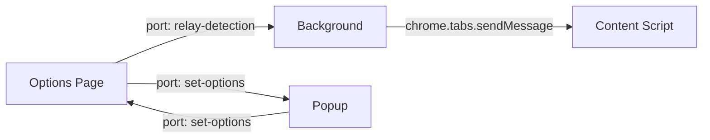

## Overview

Posture!Posture!Posture! uses Chrome's **port-based messaging** system for real-time communication between extension components. This architecture enables continuous data flow for pose detection updates (~10 messages per second) while maintaining efficient, persistent connections.

## Messaging Architecture



### Communication Channels

1. **Options ↔ Background**: Relay posture detection messages
2. **Popup ↔ Options**: Synchronize state and send commands
3. **Background → Content**: Forward posture messages to active tab

## Port-Based Messaging

### What are Ports?

Ports are **persistent messaging channels** created with `chrome.runtime.connect()`. Unlike one-time messages (`chrome.runtime.sendMessage`), ports remain open for continuous bidirectional communication.

<Note>
  Use ports when you need ongoing communication. Use one-time messages for single request/response exchanges.
</Note>

### Port Lifecycle

1. **Connect**: `chrome.runtime.connect({ name: 'port-name' })`
2. **Send**: `port.postMessage({ data })`
3. **Receive**: `port.onMessage.addListener(callback)`
4. **Disconnect**: Automatic on page close or manual `port.disconnect()`

---

## Channel 1: Options → Background → Content

### Flow: Posture Detection Messages

**Purpose**: Send real-time posture updates from Options page to Content script on active tabs.

<Tabs>
  <Tab title="Options (Sender)">
    **File**: `src/pages/Options/Options.tsx`

    The Options page connects to the Background script on mount:

    ```typescript
    let portRef = useRef<any>(null);

    useEffect(() => {
      // Connect to background script
      portRef.current = chrome.runtime.connect({ name: 'relay-detection' });
    }, []);
    ```

    When posture changes are detected:

    ```typescript
    function handlePosture(msg: { baseline?: any; posture?: any }) {
      if (msg.baseline) GOOD_POSTURE_POSITION.current = msg.baseline;
      if (msg.posture) {
        // Send posture update via port
        portRef.current.postMessage(msg);
      }
    }
    ```

    **Message format**:
    ```javascript
    { posture: 'good' }  // or 'bad'
    ```

    **Frequency**: ~10 messages per second (every 100ms during detection)
  </Tab>

  <Tab title="Background (Relay)">
    **File**: `src/pages/Background/index.js`

    The Background service worker listens for connections and relays messages:

    ```javascript
    chrome.runtime.onConnect.addListener(function (port) {
      // Listen for posture detection messages
      if (port.name === 'relay-detection') {
        port.onMessage.addListener(handlePostureMessage);
      }
    });

    function handlePostureMessage(msg) {
      chrome.tabs.query(
        {
          active: true,
          currentWindow: true,
        },
        function (tabs) {
          if (!tabs[0]) return;
          // Forward message to active tab's content script
          chrome.tabs.sendMessage(tabs[0].id, msg);
        }
      );
    }
    ```

    **Flow**:
    1. Receive message from Options via port
    2. Query for active tab in current window
    3. Send message to Content script using `chrome.tabs.sendMessage`

    <Accordion title="Why query for active tab?">
      The extension only provides feedback on the currently active tab. Querying ensures messages are sent to the tab the user is actually viewing, not background tabs.
    </Accordion>
  </Tab>

  <Tab title="Content (Receiver)">
    **File**: `src/pages/Content/Content.tsx`

    The Content script listens for messages from the Background script:

    ```typescript
    useEffect(() => {
      try {
        chrome.runtime.onMessage.addListener(function (msg: { posture: string }) {
          if (msg.posture === BAD_POSTURE) handleBadPosture();
          if (msg.posture === GOOD_POSTURE) handleGoodPosture();
          return true;
        });
      } catch (error) {
        console.error({ message: `port couldn't connect `, error });
      }
    }, []);
    ```

    **Actions**:
    - `posture: 'bad'` → Show "Sit Up Straight!" banner
    - `posture: 'good'` → Hide banner

    <Note>
      Content scripts use `chrome.runtime.onMessage` (not ports) because they receive messages via `chrome.tabs.sendMessage`, which is one-directional.
    </Note>
  </Tab>
</Tabs>

---

## Channel 2: Popup ↔ Options

### Flow: State Synchronization and Commands

**Purpose**: Synchronize UI state between Popup and Options page, and send user commands.

<Tabs>
  <Tab title="Popup (Initiator)">
    **File**: `src/pages/Popup/Popup.jsx`

    The Popup connects to the Options page when it opens:

    ```javascript
    let port = useRef(null);

    useEffect(() => {
      try {
        port.current = chrome.runtime.connect({ name: 'set-options' });

        // Listen for state updates from Options
        port.current.onMessage.addListener(function (msg) {
          if (msg.action === 'SET_IS_WATCHING')
            setIsWatching(msg.payload.isWatching);
          if (msg.action === 'SET_IS_PANEL_OPEN')
            setIsPanelOpen(msg.payload.isPanelOpen);
          setIsConnected(true);
          return true;
        });

        port.current.onDisconnect.addListener(function () {
          // Handle disconnection
        });
      } catch (error) {
        // Options page not open
      }
    }, [isPanelOpen]);
    ```

    **Sending commands**:

    ```javascript
    // Reset posture baseline
    port.current.postMessage({ action: 'RESET_POSTURE' });

    // Toggle tracking
    port.current.postMessage({
      action: 'TOGGLE_WATCHING',
      payload: { isWatching: !isWatching },
    });

    // Set deviation threshold
    port.current.postMessage({
      action: 'SET_GOOD_POSTURE_DEVIATION',
      payload: { GOOD_POSTURE_DEVIATION: 30 },
    });
    ```
  </Tab>

  <Tab title="Options (Responder)">
    **File**: `src/pages/Options/Options.tsx`

    The Options page listens for connections from the Popup:

    ```typescript
    useEffect(() => {
      chrome.runtime.onConnect.addListener(function (port) {
        if (port.name === 'set-options') {
          // Send initial state to Popup
          port.postMessage({
            action: 'SET_IS_WATCHING',
            payload: { isWatching },
          });
          port.postMessage({
            action: 'SET_IS_PANEL_OPEN',
            payload: { isPanelOpen: IS_PANEL_OPEN },
          });

          // Handle commands from Popup
          port.onMessage.addListener(async function (msg) {
            if (msg.action === 'SET_GOOD_POSTURE_DEVIATION') {
              if (!msg.payload.GOOD_POSTURE_DEVIATION) return;
              GOOD_POSTURE_DEVIATION.current = msg.payload.GOOD_POSTURE_DEVIATION;
            }

            if (msg.action === 'RESET_POSTURE') {
              GOOD_POSTURE_POSITION.current = null;
            }

            if (msg.action === 'TOGGLE_WATCHING') {
              if (msg.payload.isWatching === null) return;
              setIsWatching(msg.payload.isWatching);
              chrome.action.setBadgeText({
                text: msg.payload.isWatching ? 'ON' : 'OFF',
              });
            }
          });

          port.onDisconnect.addListener((event) => {
            // Handle disconnection
          });
        }
      });
    }, [isWatching]);
    ```

    **Flow**:
    1. Popup connects → Options sends current state immediately
    2. Popup sends command → Options updates internal state
    3. Options state changes → Sends update to Popup (if needed)
  </Tab>
</Tabs>

### Message Actions

| Action | Direction | Payload | Purpose |
|--------|-----------|---------|----------|
| `SET_IS_WATCHING` | Options → Popup | `{ isWatching: boolean }` | Sync tracking state |
| `SET_IS_PANEL_OPEN` | Options → Popup | `{ isPanelOpen: boolean }` | Sync panel state |
| `TOGGLE_WATCHING` | Popup → Options | `{ isWatching: boolean }` | Start/stop tracking |
| `RESET_POSTURE` | Popup → Options | (none) | Reset baseline |
| `SET_GOOD_POSTURE_DEVIATION` | Popup → Options | `{ GOOD_POSTURE_DEVIATION: number }` | Update threshold |

---

## Message Formats

### Posture Messages

```typescript
// Good posture detected
{ posture: 'good' }

// Bad posture detected
{ posture: 'bad' }

// Set baseline position
{ baseline: 150.5 }  // Y-coordinate in pixels
```

### Command Messages

```typescript
// Action-based format
{
  action: 'ACTION_NAME',
  payload: { /* action-specific data */ }
}
```

**Examples**:

```typescript
// Toggle tracking
{
  action: 'TOGGLE_WATCHING',
  payload: { isWatching: true }
}

// Reset posture baseline
{
  action: 'RESET_POSTURE'
}

// Update deviation threshold
{
  action: 'SET_GOOD_POSTURE_DEVIATION',
  payload: { GOOD_POSTURE_DEVIATION: 30 }
}
```

---

## Port vs One-Time Messages

<Tabs>
  <Tab title="Port-Based (Used)">
    **When to use**:
    - Continuous communication (pose updates every 100ms)
    - Bidirectional state sync (Popup ↔ Options)
    - Long-lived connections during component lifecycle

    **Advantages**:
    - Persistent connection (no reconnection overhead)
    - Two-way communication
    - Lower latency for frequent messages

    **Setup**:
    ```javascript
    // Sender
    const port = chrome.runtime.connect({ name: 'channel-name' });
    port.postMessage({ data: 'value' });

    // Receiver
    chrome.runtime.onConnect.addListener(function (port) {
      if (port.name === 'channel-name') {
        port.onMessage.addListener(function (msg) {
          // Handle message
        });
      }
    });
    ```
  </Tab>

  <Tab title="One-Time (Alternative)">
    **When to use**:
    - Single request/response
    - Infrequent messages
    - Simple queries

    **Advantages**:
    - Simpler API
    - Automatic cleanup
    - Built-in response mechanism

    **Setup**:
    ```javascript
    // Sender
    chrome.runtime.sendMessage({ data: 'value' }, function (response) {
      console.log(response);
    });

    // Receiver
    chrome.runtime.onMessage.addListener(function (msg, sender, sendResponse) {
      sendResponse({ status: 'ok' });
      return true; // Keep channel open for async response
    });
    ```

    <Note>
      This extension could use one-time messages, but ports are more efficient for high-frequency pose updates.
    </Note>
  </Tab>
</Tabs>

---

## Background as Message Relay

The Background service worker acts as a **message broker** because:

1. **Content scripts can't directly communicate with extension pages** (Options/Popup)
2. **Only background scripts can use `chrome.tabs.sendMessage`**
3. **Background scripts persist across page navigations**

### Relay Implementation

```javascript
// Background: src/pages/Background/index.js
chrome.runtime.onConnect.addListener(function (port) {
  if (port.name === 'relay-detection') {
    port.onMessage.addListener(function (msg) {
      // Query active tab
      chrome.tabs.query(
        { active: true, currentWindow: true },
        function (tabs) {
          if (!tabs[0]) return;
          // Forward to content script
          chrome.tabs.sendMessage(tabs[0].id, msg);
        }
      );
    });
  }
});
```

**Why not direct Options → Content?**

Extension pages (like Options) don't have access to `chrome.tabs` API - only background scripts do. The relay pattern is necessary for extension architecture.

---

## Connection Error Handling

### Popup When Options is Closed

```javascript
// Popup.jsx
try {
  port.current = chrome.runtime.connect({ name: 'set-options' });
  port.current.onMessage.addListener(/* ... */);
} catch (error) {
  // Options page not open - show "Open Popup" button
  console.error({ message: `port couldn't connect`, error });
}
```

### Port Disconnection

```typescript
// Options.tsx
port.onDisconnect.addListener((event) => {
  // Popup closed - no action needed
  // Port will be re-established when Popup reopens
});
```

### Missing Active Tab

```javascript
// Background/index.js
function handlePostureMessage(msg) {
  chrome.tabs.query(
    { active: true, currentWindow: true },
    function (tabs) {
      if (!tabs[0]) return; // No active tab - silently fail
      chrome.tabs.sendMessage(tabs[0].id, msg);
    }
  );
}
```

<Accordion title="What happens if Content script isn't loaded?">
  If `chrome.tabs.sendMessage` is sent to a tab where the content script hasn't loaded yet (e.g., `chrome://` pages where content scripts don't run), the message is silently dropped. This is expected behavior and doesn't cause errors.
</Accordion>

---

## Badge Updates

The extension badge shows tracking status ("ON" or "OFF"):

```javascript
// Background/index.js - Initial state
chrome.action.setBadgeText({ text: 'OFF' });

// Options.tsx - When tracking starts
chrome.action.setBadgeText({ text: 'ON' });

// Options.tsx - When tracking stops
chrome.action.setBadgeText({ text: 'OFF' });
```

Badge updates are triggered by:
- Options page: `handleToggleCamera()`
- Popup commands: `TOGGLE_WATCHING` action

---

## Performance Considerations

### Message Frequency

- **Posture updates**: ~10 messages/second (100ms interval)
- **State sync**: On-demand (only when Popup opens or state changes)
- **Commands**: User-triggered (low frequency)

### Port Persistence

```typescript
// Port created once on mount
useEffect(() => {
  portRef.current = chrome.runtime.connect({ name: 'relay-detection' });
}, []); // Empty dependency array = runs once
```

Ports remain open until:
- Component unmounts
- Page closes
- Manual `port.disconnect()`

### Memory Management

<Note>
  Ports are automatically cleaned up when pages close. No manual cleanup is required in this extension.
</Note>

---

## Debugging Messages

### Chrome DevTools

1. **Background script**: Right-click extension icon → Inspect service worker
2. **Options page**: Right-click Options page → Inspect
3. **Popup**: Right-click Popup → Inspect
4. **Content script**: Regular page DevTools → check Console

### Logging Messages

```javascript
// Log all incoming messages
port.onMessage.addListener(function (msg) {
  console.log('Received:', msg);
  // Handle message...
});

// Log outgoing messages
const message = { posture: 'good' };
console.log('Sending:', message);
port.postMessage(message);
```

### Common Issues

| Issue | Cause | Solution |
|-------|-------|----------|
| Port connection fails | Target component not loaded | Check if Options page is open |
| Messages not received | Wrong port name | Verify port names match (`relay-detection`, `set-options`) |
| Content script silent | Script not injected | Check manifest `content_scripts` matches pattern |
| Disconnection errors | Page closed/navigated | Add `onDisconnect` listener |

<Accordion title="Inspecting message flow in DevTools">
  1. Open Background script console
  2. Add breakpoint in `handlePostureMessage`
  3. Start tracking in Options page
  4. Watch messages flow through Background to Content
  5. Check Content script console for received messages
</Accordion>